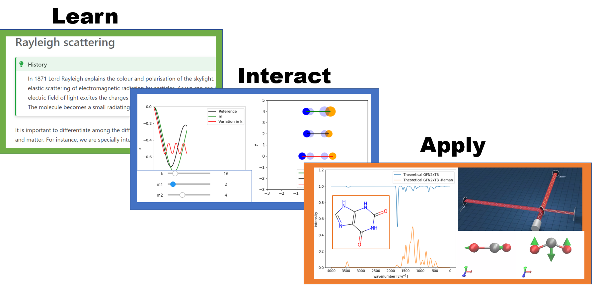
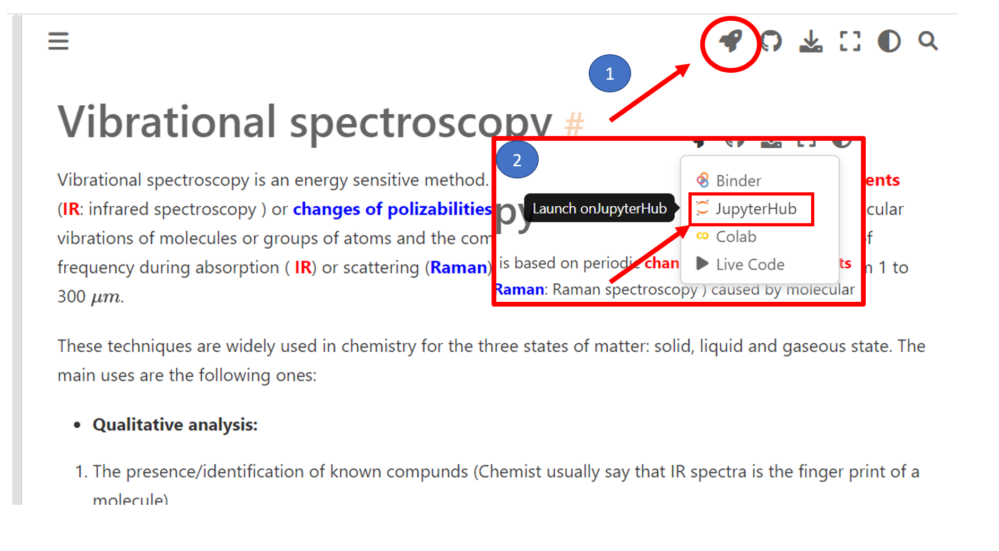
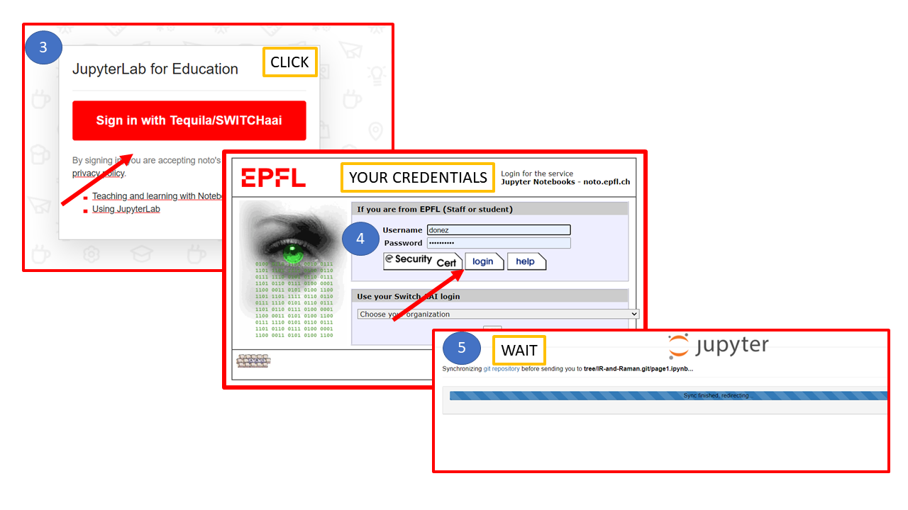
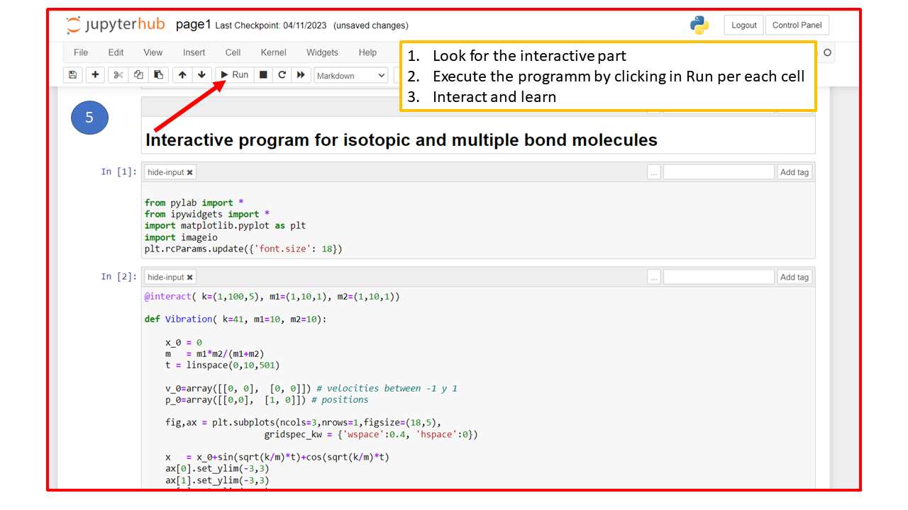
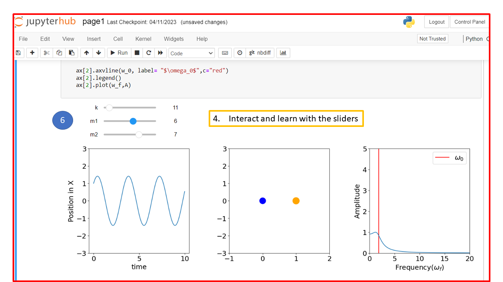

# Welcome

This notebook is aimed to illustrate the basic concepts of infrared espectra (IR) and Raman spectra

# Get Started ... 

In the following frames you will find useful information to run the notebooks in the official python repository of the EPFL: noto

